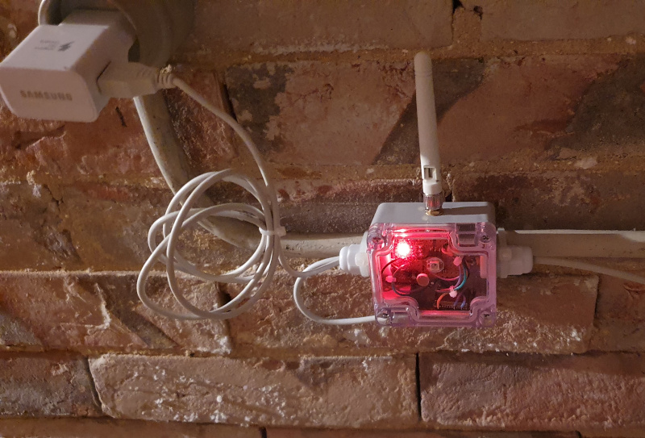
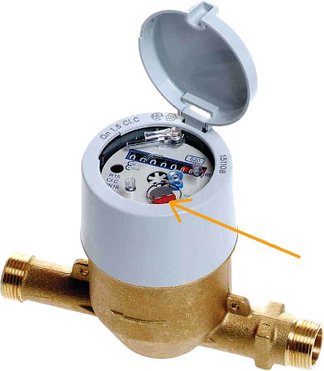
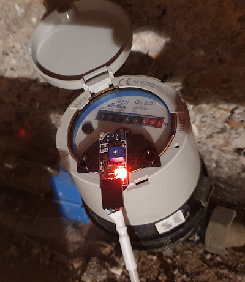

# ESPHome Water Meter

Read this in other languages: [French](README.fr.md)



## Presentation

If you have a water meter (Sensu R-315 for my part), it may have an indicator allowing you to know the current consumption fairly accurately.
Its operation is quite simple, a disc (see photo) visible in the dial of the meter rotates at a speed proportional to the flow of circulating water.
It is designed so that each complete revolution corresponds to 1L of water.

The disc consists of a reflective part and a matt part (see photo below), so, by using an adapted sensor, it is possible to detect the rotation of the disc and thus to deduce the current consumption of your meter.



In order to detect the rotation of the disk, I used a sensor [TCRT5000](docs/tcrt5000.pdf) with an IR emitting LED and a photo-transistor in the same case.
It is possible to find these sensors on stand-alone boards with an operational amplifier and an adjustable resistor for a very interesting price.

I glued the sensor on both sides with a very approximate method but it works very well, however I plan to make a 3D printable part to facilitate the installation.



## Features

### Consumption measurements

* Daily consumption
* Weekly consumption
* Monthly consumption
* Annual consumption
* Primary / secondary consumption: Meters that can be reset to 0 at any time to perform any kind of measurement.
* Current consumption: Indicates the instantaneous consumption.
* Last consumption: Indicates the last consumption (the measurement continues as long as the meter is running without interruption for more than 5 minutes).

## Updates

### 2024-01-15

* Updated using `pulse_meter` integration (used for several months with much better accuracy)
* Removed parts not directly related to water consumption measurement (led, temperature measurement)
* Having changed my meter, I no longer intend to designate a suitable support for the Sensu R-315 meter.

## Setup

First, you need to set the `pulse_gpio` used as input:

```yaml
substitutions:
  name: watermeter
  friendly_name: "Water meter"
  pulse_gpio: GPIO18
```

## Operation

The operation is quite simple and the most important YAML part is shown below:

```yaml
binary_sensor:
  # TCRT5000 pulse counter
  - platform: gpio
    id: water_pulse
    pin:
      number: $pulse_gpio
      allow_other_uses: true
    internal: true
    filters:
       - delayed_on_off: 50ms
       - lambda: |-
          id(main_counter_pulses) += x;
          id(secondary_counter_pulses) += x;
          id(daily_counter_pulses) += x;
          id(weekly_counter_pulses) += x;
          id(monthly_counter_pulses) += x;
          id(yearly_counter_pulses) += x;
          id(event_quantity) += x;
          return x;
    on_state:
       - script.execute: publish_states
```

A digital sensor is declared and uses the digital input/output 18 on which the TCRT5000 is connected.

A filter allows to suppress parasitic pulses coming from the sensor if its state is not defined during more than 50 milli-seconds.

Once the filter is passed, we land in the lambda or C code is executed and which simply consists in incrementing the global defined above.

Another part declares a pulse counter type sensor which allows to know the instantaneous consumption.

```yaml
sensor:
  - platform: pulse_meter
    id: water_pulse_counter
    name: "${friendly_name} water consumption"
    pin:
      number: $pulse_gpio
      allow_other_uses: true
    internal_filter: 100ms
    unit_of_measurement: "L/min"
    accuracy_decimals: 2
    timeout: 30s
    icon: "mdi:water"
```

## Files

* watermeter.yaml: The ESPHome configuration file
* network.yaml: Your network information
* secrets.yaml: The secret information about your network.
